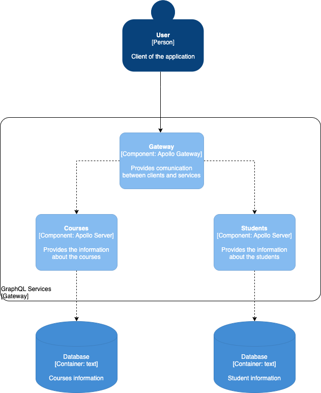

# Federated GraphQL Playground
Demo of a federated service with apollo server and apollo federation

## Stack
- Typescript
- Apollo server / Apollo federation
- Apollo gateway
- Express

## Goal
The main goal of this repo is test how a federated graphql can query data for all the related services in a single call.

The graph is composed of 2 services:
- Courses (has many students)
- Students (can be in many courses)

other component is the gateway which function is interact with any external service (frontend, mobile clients, etc).


## Architecture



## How to test it

1. Clone the repo in your machine
    ```bash
    git clone git@github.com:prodriguezval/federated-graphql-playground.git
    ```
2. Install the dependencies for every service (students, courses, gateway): 
    ```bash
    cd <service_name>
    yarn install
    cd ..
    ```
3. Start every the apollo servers (students, courses)
    ```bash
    cd <apollo_server>
    yarn start:dev
    ```
4. Start the gateway instance
    ```
    cd gateway
    yarn start:dev
    ```
5. Test the federated service in apollo playground [Apollo gateway URL](http://localhost:3000/graphql)
   ```graphql
   query {
      getAllStudents {
         id
         firstName
         lastName
         courses {
            id
            name
         }
         
      }
   }
   ```

This query will get all the students from the Students service and will query for each course id in the student info into the Course Service.
